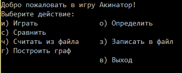
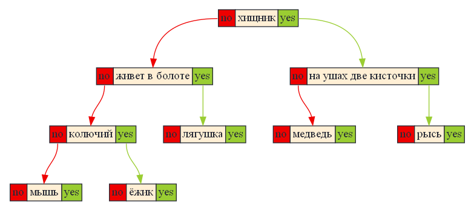

# Akinator
Акинатор - это программа, которая угадывает предметы по их описанию, даёт им определения и сравнивает объекты. 

1. [Использование.](#использование)

    1.1. [Установка библиотек.](#скачивание-необходимых-библиотек)

    1.2. [Установка программы.](#установка-программы)

2. [Описание программы.](#описание-программы)

    1.1. [Игра.](#игра)

    1.2. [Определение.](#определение)

    1.3. [Сравнение.](#сравнение)

    1.4. [Сохрание базы данных.](#сохрание-базы-данных-в-файл)

    1.5. [Чтение базы данных.](#чтение-базы-данных-из-файла)

    1.6. [Построение графа.](#построение-графа)

    1.7. [Озвучка текста.](#озвучка-текста)

## Использование.

### Скачивание необходимых библиотек:

1. Скачать `Microsoft Speach Api` для работы озвучки, либо закомментировать строчку в файле `Config.h`:
```C++
#define AKINATOR_VOICE
```
2. Скачать [Graphviz](https://graphviz.org/download/#windows) для построения графов из базы данных. Либо, можно закомментировать строчку в файле `Config.h`:
```C++
#define GRAPHVIZ
```

### Установка программы

1. Скачать репозиторий.
2. Скомпилировать проект.
Первый способ: открыть файл решения `Akinator.sln` с помощью `Microsoft Visual Studio 2019` и выполнить компиляцию `Ctrl+Shift+B`.
3. Запустить программу и наслаждаться игрой.

## Описание программы.

Программа имеет несколько режимов работы. Навигация между ними сделана в виде удобного и стильного консольного меню:

<p align="center">
    
</p>

1. #### Игра.
Пользователь загадывает объект, а программа его отгадывает, задавая вопросы о свойствах объекта. Если программа не сможет отгадать объект, то она предложит пользователю внести его в базу данных, и в следующий раз уже сможет отгадать его!

2. #### Определение.
Программа на основе базы данных о свойствах объекта даёт ему определение: называет, какими свойствами объект обладает, а какими - нет.

3. #### Сравнение.
Программа сравнивает два объекта: называет, какие свойства общие для них, а какие присущи каждому индивидуально.

4. #### Сохрание базы данных в файл.
В процессе работы программы пользователь может расширять её базу данных об объектах. Автоматически сохранение базы данных не происходит. Поэтому, чтобы не потерять данные их нужно сохранять каждый раз вручную. Можно указать указать название файла (относительный путь к нему), либо использовать значение по умолчанию `tree.txt`.

5. #### Чтение базы данных из файла.
По умолчанию программа пытается прочитать базу данных из файла `tree.txt`, если его не существует, либо файл пуст, то создаётся пустая база данных. В процессе работы программы можно считать базу данных из файла и сразу начать её использовать. . Можно указать указать название файла (относительный путь к нему), либо использовать значение по умолчанию `tree.txt`.

6. #### Построение графа.
Программа построит красивый цветной граф на основе базы данных:

<p align="center">
    
</p>

7. #### Озвучка текста.
Программа озвучивает определения и сравнения объектов. Наслаждайтесь приятными, строгими и совершенно точными определениями!